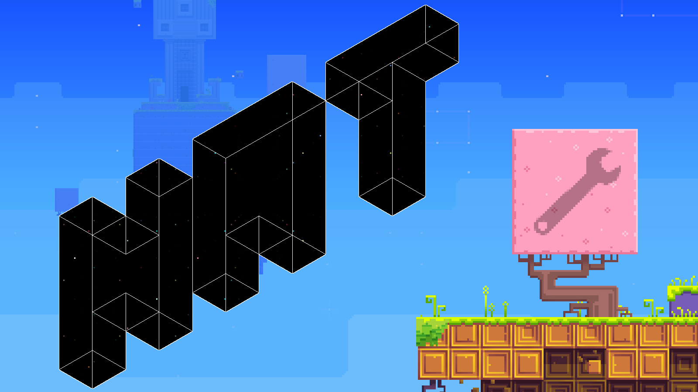

# HAT - Simple mod loader for FEZ

## Overview

**HAT** is a [MonoMod](https://github.com/MonoMod/MonoMod)-based mod loader for FEZ, currently in development. Its main purpose is to make process of FEZ modding slightly easier for end user.

When patched into the FEZ instance, it can be used to dynamically load game modifications on the game launch. Correctly prepared mods can add/override game assets or inject its own logic through custom-made plugin.

## Installing mod loader

1. Download [MonoMod](https://github.com/MonoMod/MonoMod/releases) (for .NET 4.5.2) and unpack it in the game's directory.
2. Download latest `FEZ.HAT.mm.dll` from Release tab and put it in the game's directory.
3. Run command `MonoMod.exe FEZ.exe` (or drag `FEZ.exe` onto `MonoMod.exe`). This should generate new executable file called `MONOMODDED_FEZ.exe`.
4. Run `MONOMODDED_FEZ.exe` and enjoy modding!

In the future, this process will be automated by a custom-made installer/mod manager (something like Olympus for Celeste's Everest).

## Adding mods

1. On first HAT launch, `Mods` directory should be created in the executable's directory. If not, create it.
2. Download the mod's archive and put it in this directory.
3. Start the game.

It's that simple!

## Building HAT

1. Clone repository.
2. Copy all dependencies listed in `Dependencies` directory and paste them into said directory.
3. Build it. idk. it should work.

## "Documentation"
- [Create your own HAT modifications](/Docs/createmods.md)
- [Additional HAT behaviour](/Docs/additional.md)

## Mods created for HAT
- [FEZUG](https://github.com/Krzyhau/FEZUG) - a power tool for speedrun practicing and messing with the game (NOT PORTED YET)
- [FezSonezSkin](https://github.com/Krzyhau/FezSonezSkin) - mod replacing Gomez skin with Sonic-like guy seen in Speedrun Mode thumbnail (NOT PORTED YET)
