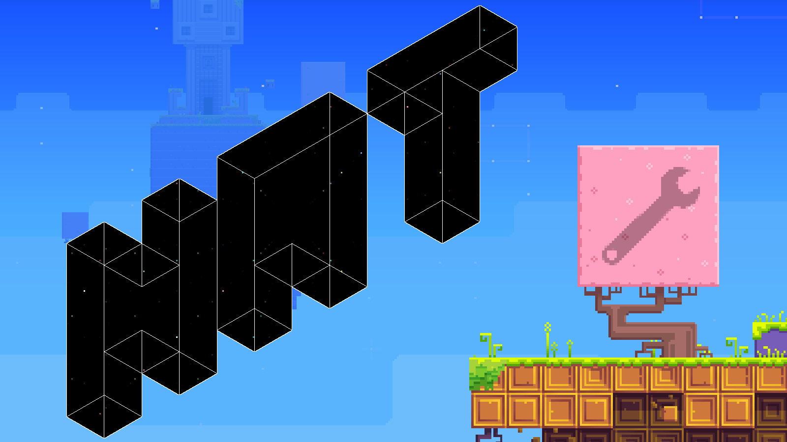

# HAT - Simple mod loader for FEZ

## Overview

**HAT** is a [MonoMod](https://github.com/MonoMod/MonoMod)-based mod loader for FEZ, currently in development. Its main purpose is to make process of FEZ modding slightly easier for end user.

When patched into the FEZ instance, it can be used to dynamically load game modifications on the game launch. Correctly prepared mods can add/override game assets or inject its own logic through custom-made plugin.

## Installing mod loader

1. Download the installer for your platform from the [Releases](../../releases) page.

| Platform | File |
|----------|------|
| Windows  | `HATinstaller-win-x64.exe` |
| Linux    | `HATinstaller-linux-x64` |
| macOS    | `HATinstaller-osx-x64` |

2. Run the installer. FEZ will be detected automatically from your Steam or GOG library. If detection fails, drop the installer into your FEZ game folder and run it from there, or use `--path <dir>`.

3. Run `HAT.Launcher.exe` (Windows) or `./HAT.Launcher` (Linux/macOS) and enjoy modding!

The original `FEZ.exe` and its platform launcher remain unchanged and continue to use the game's original .NET Framework or Mono runtime. HAT runs the patched `HAT.exe` through its own self-contained .NET 8 CoreCLR launcher.

## Adding mods

1. On first HAT launch, `Mods` directory should be created in the executable's directory. If not, create it.
2. Download the mod's archive and put it in this directory.
3. Start the game with `HAT.Launcher.exe` / `./HAT.Launcher` and enjoy your mod!

It's that simple!

## Building HAT

HAT is now using stripped game binaries and NuGet packages for building process, so it is not required to configure anything. Building HAT libraries should be as easy as cloning the repository and running the building process within the IDE of your choice (or through dotnet CLI if that's your thing).

The installer is built from `Installer/FEZ.HAT.Installer.csproj`; publishing it automatically builds and embeds the matching `Launcher/FEZ.HAT.Launcher.csproj` output. The Windows launcher must remain x86 because the original release bundles x86 native libraries; Linux and macOS use their original x64 libraries.

## "Documentation"

* [Create your own HAT modifications](/Docs/createmods.md)
* [Additional HAT behaviour](/Docs/additional.md)

## Mods created for HAT

* [FEZUG](https://github.com/Krzyhau/FEZUG) - a power tool for speedrun practicing and messing with the game
* [FezSonezSkin](https://github.com/Krzyhau/FezSonezSkin) - mod replacing Gomez skin with Sonic-like guy seen in Speedrun Mode thumbnail
* [FezMultiplayerMod](https://github.com/FEZModding/FezMultiplayerMod) - mod adding multiplayer functionalities to FEZ
