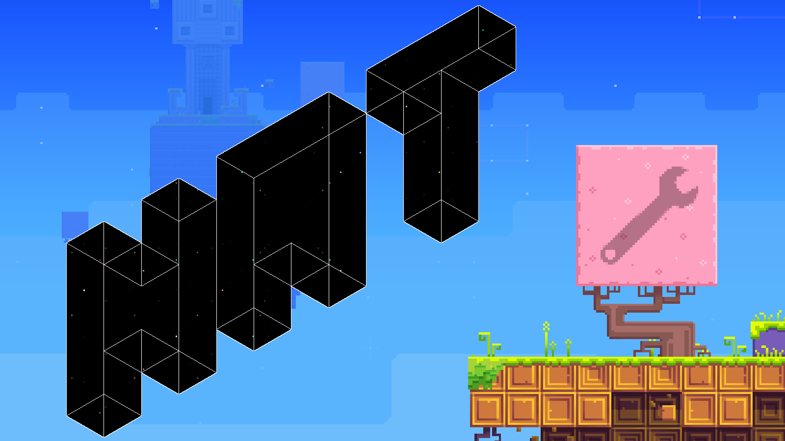

# HAT - Simple mod loader for FEZ



## Overview

**HAT** is a [MonoMod](https://github.com/MonoMod/MonoMod)-based mod loader for FEZ, currently in development. Its main purpose is to make process of FEZ modding slightly easier for end user.

When patched into the FEZ instance, it can be used to dynamically load game modifications on the game launch. Correctly prepared mods can add/override game assets or inject its own logic through custom-made plugin.

## Installing mod loader

1. Download the installer for your platform from the [Releases](../../releases) page.

| Platform | File |
|----------|------|
| Windows  | `HATinstaller-win-x64.exe` |
| Linux    | `HATinstaller-linux-x64` |
| macOS    | `HATinstaller-osx-x64` |

2. Run the installer. FEZ will be detected automatically from your Steam or GOG library. If detection fails, drop the installer into your FEZ game folder and run it from there, or use `--path <dir>`.

3. Launch FEZ from Steam or GOG, or run `FEZ.exe` (Windows) or `./FEZ` (Linux/macOS) directly, and enjoy modding!

> [!NOTE]
> To try changes before the next stable release, download installers from the
> [continuous prerelease](../../releases/tag/continuous), built from the latest successful build on `main`.

## Adding mods

1. On first HAT launch, `Mods` directory will be created in the executable's directory.
2. Download the mod's archive and put or extract it in this directory.
3. Start FEZ and enjoy your mod!

It's that simple!

## Building HAT

Install the .NET 10 SDK and clone the repository with its MonoMod submodule:

```sh
git clone git@github.com/FEZModding/HAT.git --recursive
```

For an existing local repository, run:

```
git submodule update --init --recursive
```

To build the plugin binaries on their own:

```sh
dotnet build Plugin/FEZ.HAT.mm.csproj -c Release
```

This produces the plugin binaries in `Plugin/bin/Release/`. To build a standalone installer that packages and embeds those binaries, publish for your platform's runtime ID:

```sh
dotnet publish Installer/FEZ.HAT.Installer.csproj -c Release -r linux-x64 -o artifacts/installer-publish
```

Use `win-x64` on Windows or `osx-x64` on an Intel Mac in place of `linux-x64`.

## "Documentation"

* [Create your own HAT modifications](/Docs/createmods.md)
* [Additional HAT behaviour](/Docs/additional.md)

## Mods created for HAT

* [FEZUG](https://github.com/Krzyhau/FEZUG) - a power tool for speedrun practicing and messing with the game
* [FezSonezSkin](https://github.com/Krzyhau/FezSonezSkin) - mod replacing Gomez skin with Sonic-like guy seen in Speedrun Mode thumbnail
* [FezMultiplayerMod](https://github.com/FEZModding/FezMultiplayerMod) - mod adding multiplayer functionalities to FEZ
